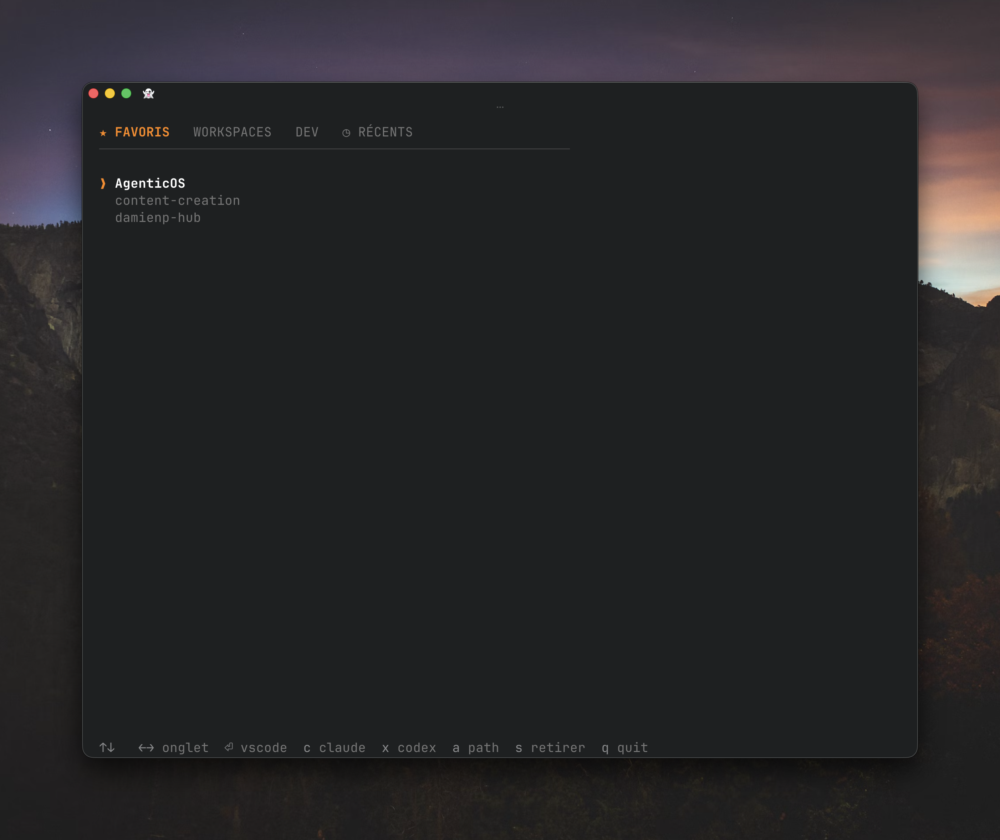

# bagent

Lanceur de workspaces en terminal (TUI) pour ouvrir un dossier dans **VSCode**, **Claude Code** ou **Codex**, en une poignée de touches.

Écrit en Go avec [Bubble Tea](https://github.com/charmbracelet/bubbletea). Successeur de `bclaude`.



## Concept

Tes workspaces sont organisés en **onglets** :

- **★ Favoris** — accès express, tu y épingles n'importe quel dossier.
- **Projets** — un onglet par dossier parent ; chaque onglet liste ses sous-dossiers.

La navigation a **deux niveaux** :

- **Barre d'onglets** (en haut) → gérer les projets.
- **Liste** (en dessous) → ouvrir et gérer les dossiers.

`←/→` change d'onglet en gardant ton niveau. `↑` depuis le 1ᵉʳ item remonte sur la barre, `↓` redescend dans la liste.

## Raccourcis

| | Touche | Action |
|---|---|---|
| **Navigation** | `←/→` `h/l` | changer d'onglet |
| | `↑/↓` `k/j` | naviguer (↑ au 1ᵉʳ item → barre, ↓ sur la barre → liste) |
| **Ouvrir un dossier** | `⏎` | VSCode |
| | `c` | Claude Code |
| | `x` | Codex |
| **Sur la barre (projets)** | `a` | nouveau projet (chemin du dossier) |
| | `s` | retirer le projet (l'onglet, le dossier reste) |
| | `r` | renommer le projet |
| | `⏎` | ouvrir le dossier dans le Finder |
| **Dans un projet** | `a` | créer un dossier |
| | `s` | supprimer un dossier (→ corbeille) |
| | `r` | renommer un dossier |
| | `f` | ajouter / retirer des favoris |
| **Dans Favoris** | `a` | ajouter un chemin |
| | `s` | retirer le favori |
| **Global** | `q` | quitter |

La **suppression** demande confirmation : la ligne (ou l'onglet) passe en rouge, puis `o`/`n`. Les vrais dossiers sont déplacés vers `~/.Trash` (jamais `rm`).

## Ligne de commande

```
bagent           # ouvrir le menu
bagent -d        # ouvrir le premier workspace dans VSCode
bagent --help    # aide
```

## Installation

macOS (Apple Silicon & Intel). **Aucune dépendance** — un binaire précompilé est téléchargé depuis les [Releases](https://github.com/damienp199/bagent/releases).

```sh
curl -fsSL https://raw.githubusercontent.com/damienp199/bagent/main/install.sh | sh
```

Le script télécharge le binaire, le signe (ad-hoc) et l'installe dans `~/.local/bin` par
renommage atomique — ce qui évite le `zsh: killed` dû au cache de signature du noyau
lors d'un remplacement de binaire en place. Assure-toi que `~/.local/bin` est dans ton `PATH`.

### Via un agent (LLM)

Si tu demandes à un agent (Claude Code, Codex…) d'installer bagent en lui pointant ce repo,
il trouve ses consignes dans [`AGENTS.md`](AGENTS.md) : la commande d'install et les pièges
macOS à éviter (notamment le renommage atomique qui prévient le `zsh: killed`).

### Depuis les sources (dev)

Nécessite [Go](https://go.dev/). Lancé depuis un clone, le même script compile au lieu de télécharger :

```sh
git clone https://github.com/damienp199/bagent.git
cd bagent
./install.sh
```

## Configuration

Deux fichiers texte, un chemin par ligne :

- `~/.config/bagent/workspaces` — les **projets**, préfixés par `>` (ex. `>/Users/moi/Documents/Dev`).
- `~/.config/bagent/favorites` — les **favoris**.

Tu peux tout gérer depuis l'interface (`a`, `s`, `f`, `r`) ; ces fichiers sont surtout utiles pour une édition manuelle ou une sauvegarde.

## Dépendances runtime

Optionnelles, détectées automatiquement : `code` (VSCode), `claude` (Claude Code), `codex`. bagent retrouve ces outils même lancé hors d'un shell interactif (il interroge ton shell de login au besoin).

## Structure

```
bagent/
├── main.go              point d'entrée
├── install.sh           script d'installation
└── internal/app/        logique applicative
    ├── app.go           CLI (flags, exécution des actions)
    ├── tui.go           modèle Bubble Tea (état, raccourcis)
    ├── view.go          rendu (onglets, liste, footer)
    ├── workspace.go     pages, config, favoris, opérations dossiers
    └── launch.go        lancement VSCode/Claude/Codex, résolution du PATH
```

Construit avec [Bubble Tea](https://github.com/charmbracelet/bubbletea) et [Lipgloss](https://github.com/charmbracelet/lipgloss).
